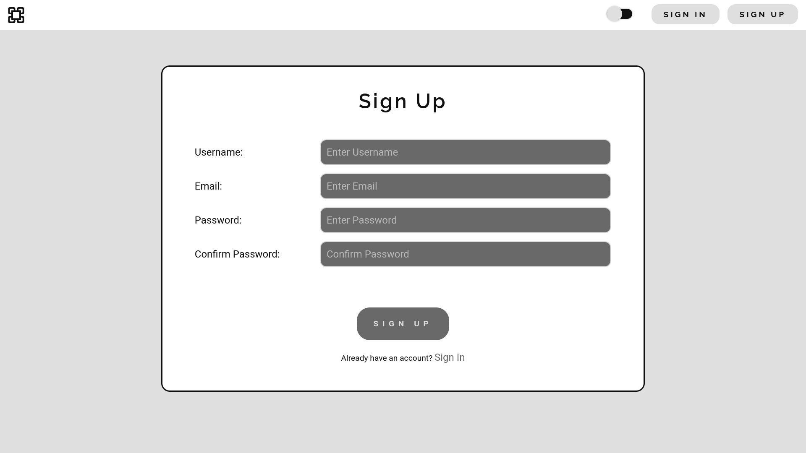
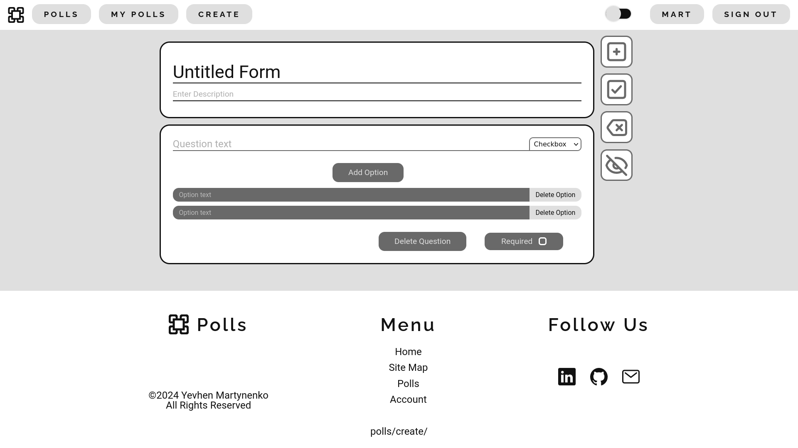
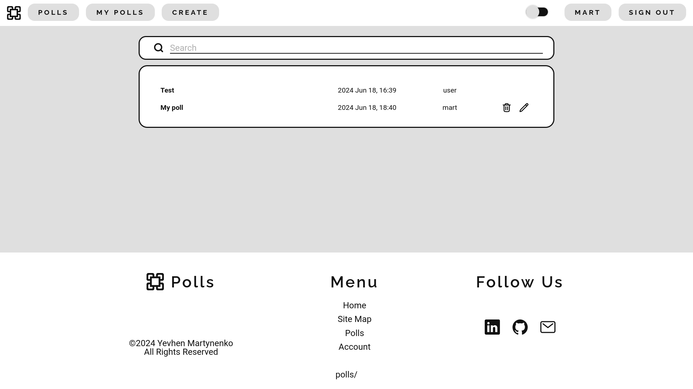

# Django Polls Website

The Django Polls Website is a web application that allows users to create and participate in polls. Users can register, log in, create polls, and vote on existing polls. The project is designed with a user-friendly interface and aims to provide a seamless experience for creating and managing polls.


## Screenshots

### Registration Page

### Poll Creation Page

### All Polls Page



## Installation

1. Clone the repository:
```bash
git clone https://github.com/<repository>.git
```

2. Create a virtual environment:
```bash
python -m venv env
```

3. Activate the virtual environment:
- For Linux/macOS:
    ```bash
    source env/bin/activate
    ```
- For Windows:
    ```bash
    .\env\Scripts\activate
    ```

4. Install the requirements:
```bash
pip install -r requirements.txt
```

5. Add `settings_secret.py` file in `~/polls/settings/` with `SECRET_KEY`, `ALLOWED_HOSTS`, `EMAIL_HOST_USER`, `EMAIL_HOST_PASSWORD` or add these settings in `settings.py`.

6. Modify the server configuration paths in configuration files (`gunicorn.conf.py`, `nginx.conf`, `nginx.service`, `site.service`).

7. Copy the service files to the systemd directory:
``` bash
sudo cp path/to/nginx.service /etc/systemd/system/
sudo cp path/to/site.service /etc/systemd/system/
```
- Or create symlinks:
```bash
sudo ln -s /path/to/nginx.service /usr/lib/systemd/system/
sudo ln -s /path/to/site.service /usr/lib/systemd/system/
```


## Usage

1. Install the app by following the installation steps above.

2. Run the app: 
``` bash
sudo systemctl start site.service nginx.service
```


## Project status
Development by the author is no longer active, but contributions from other users are welcome.
